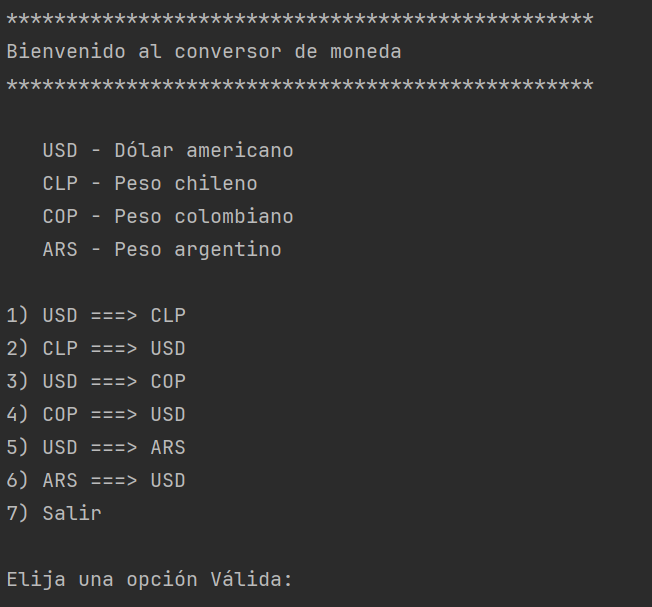
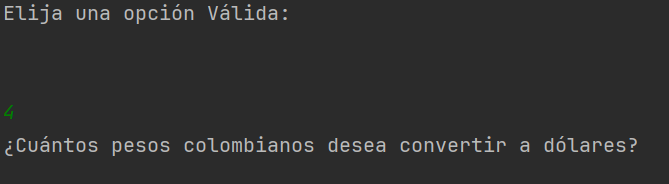
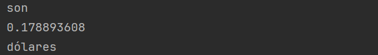

# conversorDeMonedas

Este proyecto es un conversor de monedas, donde podrás hacer el cambio de divis.
Encontrarás 6 opciones de cambio.

Despúes de que se muestre el menú deberas de escoger una opción, posteriormente se solicita
la cantidad a convertir.

Finalmente, cuando se ingrese una cantidad, el programa devolverá el valor solicitado.

versión: 1.0f
Gracias por haber adquirido el conversor de monedas <3
